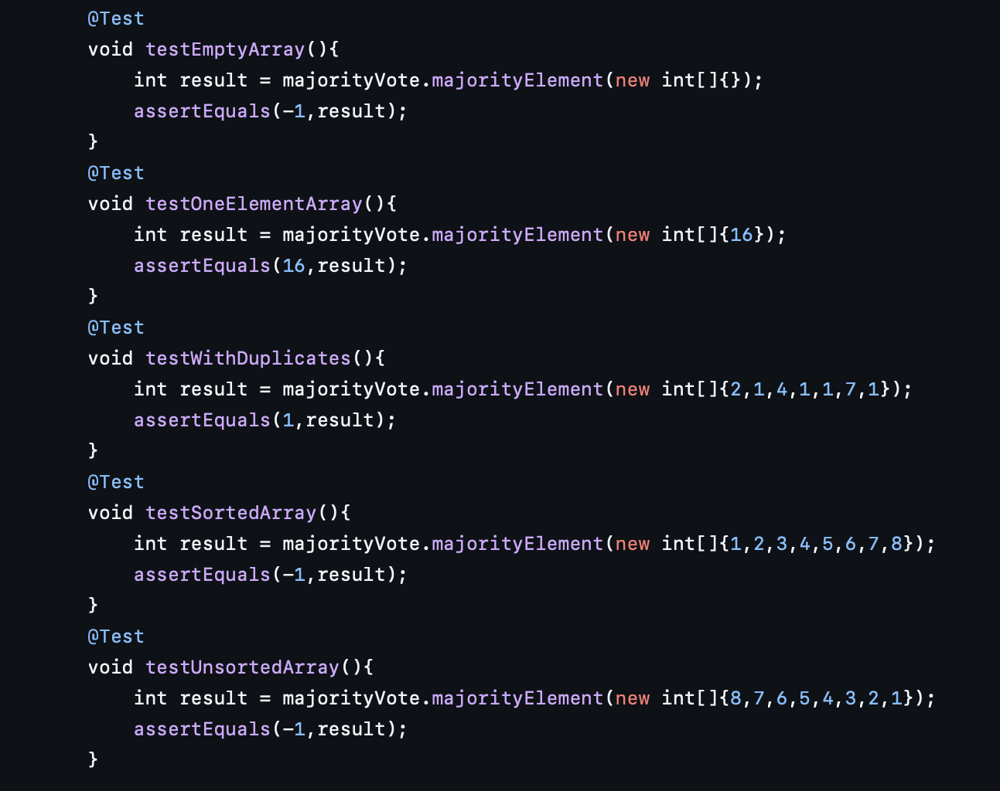

# Boyer-Moore Majority Vote Algorithm
This project implements and benchmarks the majority vote algorithm - an efficient single pass algorithm 
for detecting the majority element in an array (the element that appears more than n/2 times in an array).

## Project overview
- **Algorithm Description**
- **Asymptotic Complexity Analysis**
- **Test Cases**
- **Algorithm Benchmark Metrics**
- **Results of Metrics**
- **Summary**

## Algorithm Description
The Boyer-Moore voting algorithm is one of the popular optimal algorithms which is used to find the majority element among the given elements that have more than N/ 2 occurrences.
This works perfectly fine for finding the majority element which takes 2 traversals over the given elements, which works in O(N) time complexity and O(1) space complexity.

## Asymptotic Complexity Analysis
| Case | Time Complexity | Space Complexity   | Explanation|
|------|-----------------|--------------------|------------|
|**Best Case**|O(n)|O(1)|Single traversal; all elements identical |
|**Average Case**|O(n)|O(1)|Linear number of comparisons and constant space |
|**Worst Case**|O(n)|O(1)|No early exit; algorithm still performs single pass|

## Test Cases
 I have considered all unit test edge cases(empty,single element, duplicates,sorted and reverse-sorted arrays).

 All tests run without errors, which confirms that the code is correct.

## Algorithm Benchmark Metrics
Benchmark experiments were conducted for input sizes: `n = 100, 1000, 2000, 5000, 10000`.

**Measured metrics**
- **Comparisons**
- **Array Accesses**

|n|comparisons|array accesses|
|--|----------|--------------|
|100|201|200|
|1000|2001|2000|
|2000|4001|4000|
|5000|10001|10000|
|10000|20001|20000|

## Results of Metrics

#### n vs comparisons

#### n vs array Accesses

#### Observations:
- Both metrics increase linearly with input size `n`.
- Confirms theoretical O(n) complexity.
- Memory allocations remain constant (0 additional allocations), supporting O(1) space usage.

## Summary

#### This project demonstrates:

- The efficiency of the Boyer-Moore Majority Vote algorithm for large datasets.
- Linear scalability in both comparisons and array accesses.
- Empirical validation matches theoretical analysis.

Boyer-Moore Majority Vote remains one of the most elegant and efficient single-pass solutions for detecting majority elements — combining simplicity, performance, and minimal space usage.

